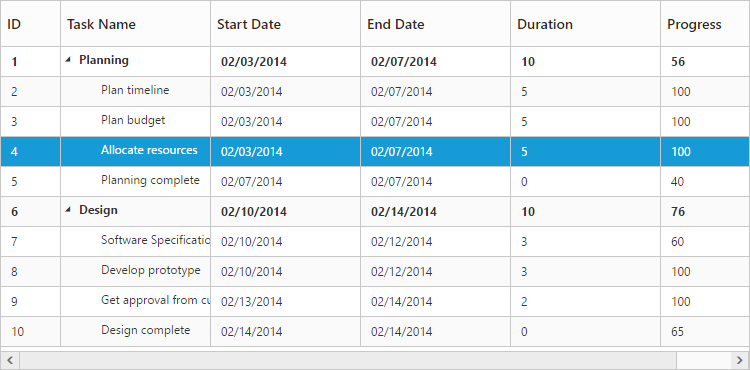
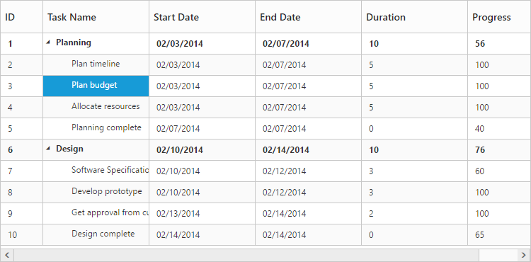
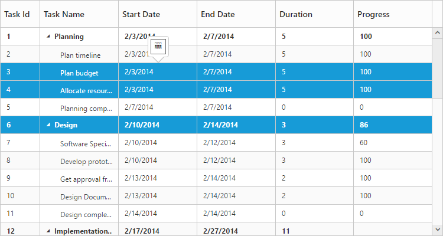

# Selection

The TreeGrid control provides support for row and cell selections. 

## Row selection

You can enable or disable the row selection in TreeGrid, using `allowSelection` property. By default row selection is enabled in TreeGrid.
The following code example shows you to disable the row selection in TreeGrid.



<ej-treegrid id="TreeGridControl" [allowSelection]="false"
    //...>
</ej-treegrid>



The output of the TreeGrid with row selection is as follows.

### Selecting a row at initial load

You can select a row at initial load by setting the index of the row to the `selectedRowIndex` property.

Find the following code for selecting a row at initial load.



<ej-treegrid id="TreeGridControl" [selectedRowIndex]="selectedRowIndex"
    //...>
</ej-treegrid>





import {Component} from '@angular/core';

@Component({
    selector: 'ej-app',
    templateUrl: 'app/app.component.html',
    styleUrls: ['app/app.component.css']
})
export class AppComponent {
    public selectedRowIndex: any;
    constructor() {
        //...
        this.selectedRowIndex = 3
    }
}



### Multiple row selection

It is also possible to select multiple rows by setting `selectionSettings.selectionType` as `multiple`. You can select more than one row by holding down `CTRL` key and to click on the rows. 
The following code example explains how to enable multiple selection in TreeGrid.



<ej-treegrid id="TreeGridControl" [selectionSettings]="selectionSettings"
    //...>
</ej-treegrid>





import {Component} from '@angular/core';

@Component({
    selector: 'ej-app',
    templateUrl: 'app/app.component.html',
    styleUrls: ['app/app.component.css']
})
export class AppComponent {
    public selectionSettings: any;
    constructor() {
        //...
        this.selectionSettings = {
            selectionType: "ej.TreeGrid.SelectionType.Multiple"
        }
    }
}



The output of the TreeGrid with multiple row selection is as follows.

To enable multiple selection, you can set `selectionSettings.selectionType` property either as `multiple` or enumeration value `ej.TreeGrid.SelectionType.Multiple`.

### Selecting a row programmatically 

You can select a row programmatically by setting the row index value to `selectedRowIndex` property. 
The following code shows on how to select a row programmatically with button click action,



<button id="selectRow" (click)="selectRow($event, item)">SelectRow</button>
<ej-treegrid id="TreeGridControl" 
    //...>
</ej-treegrid>





import {Component} from '@angular/core';

@Component({
    selector: 'ej-app',
    templateUrl: 'app/app.component.html'
})
export class AppComponent {
    constructor() {
        //...
    }
    public selectRow(event, item) {
        $("#TreeGridControl ").ejTreeGrid("option", "selectedRowIndex", 4);
    }
}



## Cell selection

You can select cells in TreeGrid by setting `selectionSettings.selectionMode` property as `cell`.
Find the code example below to enable the cell selection in TreeGrid.



<ej-treegrid id="TreeGridControl" [selectionSettings]="selectionSettings"
    //...>
</ej-treegrid>





import {Component} from '@angular/core';

@Component({
    selector: 'ej-app',
    templateUrl: 'app/app.component.html',
    styleUrls: ['app/app.component.css']
})
export class AppComponent {
    public selectionSettings: any;
    constructor() {
        //...
        this.selectionSettings = {
            selectionMode: "ej.TreeGrid.SelectionType.Cell",
        }
    }
}



The output of the TreeGrid with cell selection is as follows.

### Multiple cell selection

You can also select multiple cell by setting `selectionSettings.selectionType` property as `multiple`. 
Multiple selection can be done by holding the `CTRL` key and to click the required cells. 
The following code example shows you to select multiple cells.


<ej-treegrid id="TreeGridControl" [selectionSettings]="selectionSettings"
    //...>
</ej-treegrid>





import {Component} from '@angular/core';

@Component({
    selector: 'ej-app',
    templateUrl: 'app/app.component.html'
})
export class AppComponent {
    public selectionSettings: any;
    constructor() {
        //...
        this.selectionSettings = {
            selectionType: "ej.TreeGrid.SelectionType.Multiple",
            selectionMode: "ej.TreeGrid.SelectionType.Cell",
        }
    }
}



The output of the TreeGrid with multiple cell selection is as follows.

### Selecting cells programmatically 

You can select the cells programmatically using `selectCells` public method. Find the code example below for selecting TreeGrid cells programmatically



<button id="selectCells" (click)="selectCells($event, item)">SelectCells</button>
<ej-treegrid id="TreeGridControl" 
    //...>
</ej-treegrid>





import { Component } from '@angular/core';

@Component({
  selector: 'ej-app',
    templateUrl: 'app/app.component.html'
})
export class AppComponent {
  constructor() {
   //...
  }
   public selectCells(event, item) {
          var TreeGridObj = $("#TreeGridControl").data("ejTreeGrid");
            cellIndex = [{ rowIndex: 2, cellIndex: 1 }, {rowIndex:3,cellIndex:1}];
            TreeGridObj.selectCells(cellIndex);
    }
}



## Checkbox selection

TreeGrid supports checkbox selection and to enable the checkbox selection, you need to set `selectionSettings.selectionType` property to `checkbox` and `selectionSettings.selectionMode` property as `row`. By default, checkbox column will be displayed as the left most column, on enabling the checkbox selection in TreeGrid.

### Column header checkbox

It is possible to select/unselect all the TreeGrid rows using column header checkbox. To enable this you need to set, `selectionSettings.enableSelectAll` property as `true`. The following code snippet explains how to enable the column header checkbox,



<ej-treegrid id="TreeGridControl" 
            [selectionSettings]="selectionSettings"
    //...>
</ej-treegrid>





import {Component} from '@angular/core';

@Component({
    selector: 'ej-app',
    templateUrl: 'app/app.component.html'
})
export class AppComponent {
    public selectionSettings: any;
    constructor() {
        //...
        this.selectionSettings = {
            selectionType: "ej.TreeGrid.SelectionType.Checkbox",
            selectionMode: "ej.TreeGrid.SelectionType.Row",
            enableSelectAll: true,
        }
    }
}



The output of the TreeGrid with checkbox enabled in column header

### Hierarchy selection
It is possible to select the rows hierarchically using checkboxes in TreeGrid by enabling the `selectionSettings.enableHierarchySelection` property.
In this selection the hierarchy between the records will be retained, where the child records will get selected on selecting its parent record’s checkbox and parent record checkbox will get selected on checking all of its child items. 

Following code snippet explains on enabling hierarchy selection in TreeGrid.


<ej-treegrid id="TreeGridControl" 
            [selectionSettings]="selectionSettings"
    //...>
</ej-treegrid>





import {Component} from '@angular/core';

@Component({
    selector: 'ej-app',
    templateUrl: 'app/app.component.html'
})
export class AppComponent {
    public selectionSettings: any;
    constructor() {
        //...
        this.selectionSettings = {
            selectionType: "ej.TreeGrid.SelectionType.Checkbox",
            selectionMode: " ej.TreeGrid.SelectionType.Row",
            enableHierarchySelection: true,
        }
    }
}



The output of the TreeGrid with hierarchy selection enabled

### Checkbox column

It is possible to change the default index of the checkbox column and we can display the checkboxes in any of the existing column. And to enable the checkbox in any of the column, we need to set `showCheckbox` property as true in the column object.



<ej-treegrid id="TreeGridControl" 
            [selectionSettings]="selectionSettings"
            [columns]="columns"
            
    //...>
</ej-treegrid>





import {Component} from '@angular/core';

@Component({
    selector: 'ej-app',
    templateUrl: 'app/app.component.html',
    styleUrls: ['app/app.component.css']
})
export class AppComponent {
    public selectionSettings: any;
    public columns: any;
    constructor() {
        //...
        this.selectionSettings = {
            selectionType: "ej.TreeGrid.SelectionType.Checkbox",
            selectionMode: " ej.TreeGrid.SelectionType.Row"
        }
        this.columns = [{
                field: "taskID",
                headerText: "Task Id",
                editType: "numericedit"
            },
            {
                field: "taskName",
                headerText: "Task Name",
                editType: "stringedit",
                showCheckbox: true
            },
        ]
    }
}



The output of the TreeGrid with checkbox enabled in task name column.

## MultiSelection – Touch Option

It is possible to select cells using touch action in TreeGrid. TreeGrid provides support for both single selection and multiple cell selection using touch action. For multiple cell selection, when we tap on a cell, a helper icon will be displayed using which we can select multiple cells.

The following code example describes how to enable multiple selection in TreeGrid.



<ej-treegrid id="TreeGridControl" 
            [selectionSettings]="selectionSettings"
    //...>
</ej-treegrid>





import {Component} from '@angular/core';

@Component({
    selector: 'ej-app',
    templateUrl: 'app/app.component.html',
    styleUrls: ['app/app.component.css']
})
export class AppComponent {
    public selectionSettings: any;
    constructor() {
        //...
        this.selectionSettings = {
            selectionType: "ej.TreeGrid.SelectionType.Multiple"
        }
    }
}



The following output is displayed the result of multiple selection in touch device environment.

