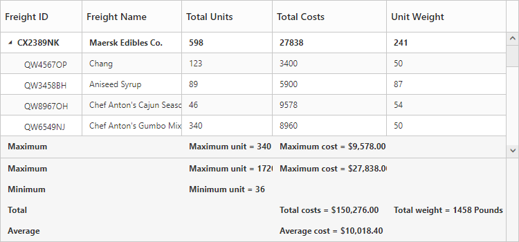

# Summary Row

Summary rows in TreeGrid is used to summarize every hierarchy with the set of predefined summary types using the column values. 

* [`summaryRows`](https://help.syncfusion.com/api/js/ejtreegrid#members:summaryrows "summaryRows") - Using this property, user can define the summary rows in TreeGrid.
* [`summaryRows.title`](https://help.syncfusion.com/api/js/ejtreegrid#members:summaryrows-title "summaryRows.title") - Title for each summary row can be defined using this property. 
* [`summaryRows.summaryColumns`](https://help.syncfusion.com/api/js/ejtreegrid#members:summaryrows-summarycolumns "summaryRows.summaryColumns") - Using this property, it is possible to defined the summary for specific columns alone in a summary row.
* [`showSummaryRow`](https://help.syncfusion.com/api/js/ejtreegrid#members:showsummaryrow "showSummaryRow") - This property is to make the summary row visible. 
* [`showTotalSummary`](https://help.syncfusion.com/api/js/ejtreegrid#members:showtotalsummary "showTotalSummary") - This property is to make the total summary row visible which is the overall summary row displayed for all the rows in the TreeGrid content.

## Defining summary columns

* [`summaryType`](https://help.syncfusion.com/api/js/ejtreegrid#members:summaryrows-summarycolumns-summarytype "summaryRows.summaryColumn.summaryType") - Using this property, user can define the type of summary to be displayed in a column. 
* [`dataMember`](https://help.syncfusion.com/api/js/ejtreegrid#members:summaryrows-summarycolumns-datamember "summaryRows.summaryColumns.dataMember") - This property is used to map the field values which is used for summary calculations.
* [`displayColumn`](https://help.syncfusion.com/api/js/ejtreegrid#members:summaryrows-summarycolumns-displaycolumn "summaryRows.summaryColumns.displayColumn") - This property is used to specify the column in which the summary to be displayed.
* [`prefix`](https://help.syncfusion.com/api/js/ejtreegrid#members:summaryrows-summarycolumns-prefix "summaryRows.summaryColumns.prefix") and [`suffix`](https://help.syncfusion.com/api/js/ejtreegrid#members:summaryrows-summarycolumns-suffix "summaryRows.summaryColumns.suffix") properties are used to define the text should be displayed along with the summary column value.
* [`format`](https://help.syncfusion.com/api/js/ejtreegrid#members:summaryrows-summarycolumns-format "summaryRows.summaryColumns.format") property is used for formatting the summary column value.

The below code snippet explains defining a summary row in TreeGrid,

<ej-treegrid id="TreeGridControl" [dataSource]="treeGridData" 
[showSummaryRow] = "true"
[showTotalSummary] = "true"
[summaryRows] = "summaryrows" >
    //..
</ej-treegrid>



import {Component} from '@angular/core';
@Component({
    selector: 'ej-app',
    templateUrl: 'app/app.component.html',
    styleUrls: ['app/app.component.css']
})
export class AppComponent {   
	public summaryrows : any;
    constructor() {
        //...
         this.summaryrows = [{
                           title: "Maximum",
                           summaryColumns: [
                               {
                                   summaryType: ej.TreeGrid.SummaryType.Maximum,
                                   dataMember: "TotalUnits",
                                   displayColumn: "TotalUnits",
                                   prefix: "Maximum unit = "
                               },
                               {
                                   summaryType: ej.TreeGrid.SummaryType.Maximum,
                                   dataMember: "TotalCosts",
                                   displayColumn: "TotalCosts",
                                   prefix: "Maximum Cost = ",
                                   format: "{0:C}"
                               }
                           ]
                       },
                       {
                           title: "Total",
                           summaryColumns: [
                               {
                                   summaryType: ej.TreeGrid.SummaryType.Sum,
                                   dataMember: "TotalCosts",
                                   displayColumn: "TotalCosts",
                                   prefix: "Total costs = ",
                                   format: "{0:C}"
                               },
                               {
                                   summaryType: ej.TreeGrid.SummaryType.Sum,
                                   dataMember: "UnitWeight",
                                   displayColumn: "UnitWeight",
                                   prefix: "Total weight = ",
                                   suffix: " Pounds"
                               }]
                       }],
    }   
}


The below screenshot shows the output of above code example.

## Customize height of total summary

Using [`totalSummaryHeight`](https://help.syncfusion.com/api/js/ejtreegrid#members:totalSummaryHeight "totalSummaryHeight") property we can customize the height of the total summary container.
The below code example shows how to update the footer summary container height.

<ej-treegrid id="TreeGridControl" [dataSource]="treeGridData" 
[showTotalSummary] = "true"
[totalSummaryHeight] = totalSummaryHeight >
    //..
</ej-treegrid>



import {Component} from '@angular/core';
@Component({
    selector: 'ej-app',
    templateUrl: 'app/app.component.html',
    styleUrls: ['app/app.component.css']
})
export class AppComponent {
    constructor() {
        //...       
    }   
	public totalSummaryHeight = 120;
}

The below screenshot shows the output of above code example.

## Expand/collapse total summary row

We can expand/collapse the total summary rows in TreeGrid using following methods.

* Using Expander Icon
* Using Method

### Using Expander Icon

We can enable expander icon in total summary row by using [`collapsibleTotalSummary`](https://help.syncfusion.com/api/js/ejtreegrid#members:collapsibleTotalSummary "collapsibleTotalSummary") property. By default expander icon will be rendered in first row of 0th column in total summary rows.
Please find the below code example to enable collapsible total summary row in TreeGrid.

<ej-treegrid id="TreeGridControl" [dataSource]="treeGridData" 
[showTotalSummary] = "true"
[collapsibleTotalSummary] = "true" >
    //..
</ej-treegrid>


N> We can also customize the expander icon column in total summary row by using `_summaryColumnIndex` property and [`load`](https://help.syncfusion.com/api/js/ejgantt#events:load "load") event.

### Using Method

Total summary rows in TreeGrid can be expanded/collapsed by using [`expandCollapseTotalSummary`](https://help.syncfusion.com/api/js/ejgantt#methods:expandCollapseTotalSummary "expandCollapseTotalSummary") method.
Please find the code example to collapse the total summary rows below.


<button (click)="expandCollapse($event, item)">expandCollapse</button>
<ej-treegrid id="TreeGridControl" [dataSource]="treeGridData" 
[showTotalSummary] = "true"
[collapsibleTotalSummary] = "true" >
    //..
</ej-treegrid>



import {Component} from '@angular/core';
@Component({
    selector: 'ej-app',
    templateUrl: 'app/app.component.html',
    styleUrls: ['app/app.component.css']
})
export class AppComponent {
    constructor() {
        //...       
    }   
	 public expandCollapse(event, item) {
        var treeObj = $("#TreeGridControl").data("ejTreeGrid");
            treeObj.expandCollapseTotalSummary(false);
    }
}


## Custom Summary

Custom summary can be used to create summary values based on your required custom logic and calculations. To enable the custom summary, the [summaryType](https://help.syncfusion.com/api/angular/ejtreegrid#members:summaryrows-summarycolumns-summarytype "summaryType") should be set to 'custom' and the [customSummaryValue](https://help.syncfusion.com/api/angular/ejtreegrid#members:summaryrows-summarycolumns-customsummaryvalue "customSummaryValue") property should be defined as function. After the custom calculation, the returned value will be displayed in the corresponding summary cell.


<ej-treegrid id="TreeGridControl" showSummaryRow="true" [summaryRows]="summaryRow">
</ej-treegrid>



import {Component} from '@angular/core';
@Component({
    selector: 'ej-app',
    templateUrl: 'app/app.component.html',
    styleUrls: ['app/app.component.css']
})
export class DefaultComponent {
  summaryRow:any;
  constructor(public ganttDataService: GanttDataService) {
    this.treeGridData = ganttDataService.getGanttData();
	this.summaryRow=[
            {
                title: "Custom Summary",
                summaryColumns: [{
                    summaryType: ej.TreeGrid.SummaryType.Custom,
                    customSummaryValue: function currency(args,data){
                         return ej.sum(data, "TotalCosts");
                    },
                    displayColumn: "TotalCosts"
                }]
            }
        ],
  }
  function currency(args, data) {
        //ej.sum is aggregate to add data of total costs from datasource
        return ej.sum(data, "TotalCosts");
    }



The output of the tree grid with custom summary value is as follows.

