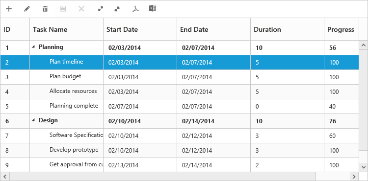

# Toolbar

In TreeGrid we can show/hide the Toolbar by using [`toolbarSettings.showToolbar`](https://help.syncfusion.com/api/js/ejtreegrid#members:toolbarsettings-showtoolbar "showToolbar") property.We can add default toolbar items by [`toolbarSettings.toolbarItems`](https://help.syncfusion.com/api/js/ejtreegrid#members:toolbarsettings-toolbaritems "toolbarItems"). User can also create a custom toolbar items by using [`toolbarSettings.customToolbarItems`](https://help.syncfusion.com/api/js/ejtreegrid#members:toolbarsettings-customToolbarItems "customToolbarItems").

## Default Toolbar Items
Using TreeGrid default toolbar items we can perform below operations.

* **Add**- To add new task.

* **Edit**-To edit a selected task.

* **Delete**- To delete a selected task.
		   
* **Cancel**- To cancel the edited changes in a task.
		   
* **Update**- To save the edited changes in a task.
		   
* **ExpandAll**- To expand all the TreeGrid rows.
		   
* **CollapseAll**- To collapse all the TreeGrid rows.
		   
* **PdfExport**- To export TreeGrid in PDF format.
		   
* **ExcelExport**- To export TreeGrid in Excel format.

* **Print**- To Print the TreeGrid.

We can enable TreeGrid toolbar by using below code example:



<ej-treegrid id="TreeGridControl" [toolbarSettings]="toolbarSettings"
//...>
</ej-treegrid>





import {Component} from '@angular/core';

@Component({
    selector: 'ej-app',
    templateUrl: 'app/app.component.html'
})
export class AppComponent {
    public toolbarSettings: any;
    constructor() {
        //...
        this.toolbarSettings = {
            showToolbar: true,
            toolbarItems: [
                ej.TreeGrid.ToolbarItems.Add,
                ej.TreeGrid.ToolbarItems.Edit,
                ej.TreeGrid.ToolbarItems.Delete,
                ej.TreeGrid.ToolbarItems.Update,
                ej.TreeGrid.ToolbarItems.Cancel,
                ej.TreeGrid.ToolbarItems.ExpandAll,
                ej.TreeGrid.ToolbarItems.CollapseAll,
                ej.TreeGrid.ToolbarItems.PdfExport,
                ej.TreeGrid.ToolbarItems.ExcelExport,
                ej.TreeGrid.ToolbarItems.Print
            ],
        }
    }
}



The following screenshot displays the toolbar option in TreeGrid control.

N> To perform add,edit,delete,cancel,update using Toolbar items we need to enable add/edit/delete using [`editSettings`](https://help.syncfusion.com/api/js/ejtreegrid#members:editsettings "editSettings").
  
## Custom Toolbar Items

CustomToolbarItems allows us to insert custom icons and custom template in TreeGrid toolbar. By using below properties we can customize TreeGrid toolbar as per our requirement.

* **text**- To insert the custom icons in toolbar using CSS class name selector.

* **templateID**-To insert the custom icons in toolbar using script templates. Using this property we can bind HTML elements and other EJ controls to TreeGrid toolbar.

* **tooltipText**-Displays tooltip text for the custom icons.

To insert EJ Controls in TreeGrid toolbar we need to initiate the control in [`create`](https://help.syncfusion.com/api/js/ejtreegrid#events:create "create") client side event.In [`toolbarClick`](https://help.syncfusion.com/api/js/ejtreegrid#events:toolbarclick "toolbarclick") client side event we can bind actions to the custom toolbar items.


    




<ej-treegrid id="TreeGridControl" (toolbarClick)="toolbarClick($event)" (create)="create($event)" [toolbarSettings]="toolbarSettings"
    //...>
</ej-treegrid>





import {Component} from '@angular/core';

@Component({
    selector: 'ej-app',
    templateUrl: 'app/app.component.html',
    styleUrls: ['app/app.component.css']
})
export class AppComponent {
    public toolbarSettings: any;

    constructor() {
        //...
        this.toolbarSettings = {
            showToolbar: true,
            customToolbarItems: [{
                    templateID: "#ColumnVisibility",
                    tooltipText: "Column Visibility"
                },
                {
                    text: "Reset",
                    tooltipText: "Reset"
                }
            ],
        }
    }
    toolbarClick(sender) {
        if (sender.itemName == "Reset") {
            //we can bind the custom actions here
        }
    }
    create(sender) {
        //Here we can append custom EJ controls
        $("#dropdownContainer").ejDropDownList({});
    }
}



write the below code in app.component.css file.

  

#TreeGridControl {
    padding - top: 2 px;
    padding - bottom: 0 px;
}
.Reset: before {
    content: "\e677";
}



[Click](http://js.syncfusion.com/demos/web/#!/bootstrap/treegrid/toolbartemplate) here to view the demo sample for custom toolbar item