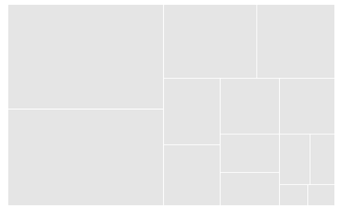
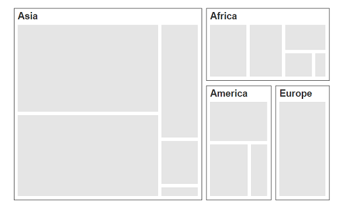
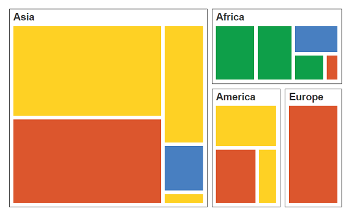
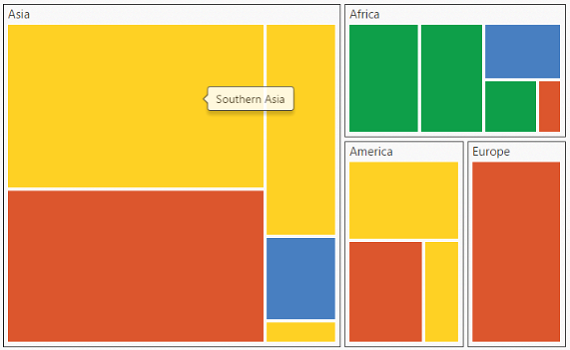
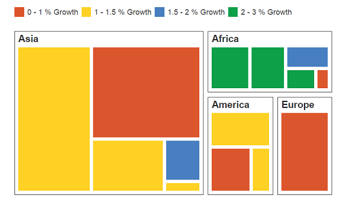

#Getting Started

Before we start with the TreeMap, please refer [this page](https://help.syncfusion.com/angular-2/overview) for general information regarding integrating Syncfusion widget’s.

## Adding JavaScript and CSS Reference

To render the TreeMap control, the following list of external dependencies are needed, 

* [jQuery](http://jquery.com) - 1.7.1 and later versions
* [jsRender](https://github.com/borismoore/jsrender) - to render the templates
* [Angular](https://angular.io/) - Angular latest versions

The other required internal dependencies are tabulated below,

<table>
   <tr>
      <th>
         <b>Files</b>
      </th>
      <th>
         <b>Description/Usage </b>
      </th>
   </tr>
   <tr>
      <td>
         ej.core.min.js
      </td>
      <td>
        It is referred always before using all the JS controls.
      </td>
   </tr>
   <tr>
      <td>
         ej.data.min.js
      </td>
      <td>
         Used to handle data operation and is used while binding data to the JS controls.
      </td>
   </tr>
   <tr>
      <td>
        ej.treemap.min.js
      </td>
      <td>
        TreeMap core script file which includes TreeMap related scripts files.
      </td>
   </tr>
</table>

N> TreeMap uses one or more script files, therefore refer the `ej.web.all.min.js` (which encapsulates all the `ej` controls and frameworks in a single file) in the application instead of referring all the above specified internal dependencies. 

To get the real appearance of the TreeMap, the dependent CSS file `ej.web.all.min.css` (which includes styles of all the widgets) should also needs to be referred.

## Preparing HTML document

Create an HTML page and add the scripts references in the order mentioned in the following code example.



    <html>
    <head>
    <title>Angular TreeMap</title>

    <!-- Essential Studio for JavaScript  theme reference -->
    <link rel="stylesheet" href="http://cdn.syncfusion.com/{{ site.releaseversion }}/js/web/flat-azure/ej.web.all.min.css" />

    <!-- Angular related script references -->
    <!-- 1. Load libraries -->
         <!-- Polyfill(s) for older browsers -->
       
    
    
    

    <!-- Essential Studio for JavaScript  script references -->
    
     
    
    
    <!-- 2. Configure SystemJS -->
    
    

    </head>
    <!-- 3. Display the application -->
    <body>
    <ej-app>  
		    

			      
Angular Syncfusion Components App

			      

		    

	  </ej-app>
    </body>
    </html>



N> Uncompressed version of library files are also available which is used for development or debugging purpose and can be generated from the custom script [here](http://csg.syncfusion.com).

## Control Initialization

* Copy TreeMap Syncfusion Angular source component(s) from the below build location and add it in `src/ej` folder (For ex., consider the `treemap` component).


(Installed Location)\Syncfusion\Essential Studio\14.3.0.49\JavaScript\assets-src\angular2\ 


N> `core.ts` file is mandatory for all Syncfusion JavaScript Angular components. The repository having the source file from Essential Studio for JavaScript v14.3.0.49.

* Create `treemap` folder inside `src` folder.

* Create `treemap.component.html` view file inside `src/treemap` folder and render ejTreeMap Angular component using the below code example. 


<ej-treemap id="defaulttreemap">
</ej-treemap>


* Create `treemap.component.ts` model file inside the folder `src/treemap` and create sample component using the below code example.



import { Component, ViewEncapsulation } from '@angular/core';

@Component({
  selector: 'ej-app',
  templateUrl: 'src/treemap/treemap.component.html'
})
export class TreeMapComponent {

}


## Configure the routes for the Router

Before adding router configuration for above created ejTreeMap component, we recommend you to go through the [Angular Routing](https://angular.io/docs/ts/latest/guide/router.html) configuration to get the deeper knowledge about Angular routing. 

* Now, we are going to configure the route navigation link for created treemap sample in `src/app.component.html` file.



	<ul class="nav navbar-nav">
		<li>
           <a data-toggle="collapse" data-target="#skeleton-navigation-navbar-collapse.in" 
           href="#treemap" [routerLink]="['/treemap']">treemap </a>
        </li>
	</ul>

<main>
	<router-outlet></router-outlet>
</main>


* Import the ejTreeMap sample component and define the route in `src/app.routes.ts` file.


import { Routes } from '@angular/router';
. . . . 
import { TreeMapComponent } from './treemap/treemap.component';

export const rootRouterConfig: Routes = [
    { path: '', redirectTo: 'home', pathMatch: 'full' },
    . . . . 
    { path: 'treemap', component: TreeMapComponent }
];


* Import and declare the Syncfusion source component and ejTreemap sample component into `app.module.ts` like the below code snippet.


import { NgModule, enableProdMode, ErrorHandler } from '@angular/core';
. . . . . 
import { EJ_TREEMAP_COMPONENTS } from './ej/treemap.component';
import { TreeMapComponent } from './treemap/treemap.component';

import { rootRouterConfig } from './app.routes';
. . . . 
@NgModule({
  imports: [BrowserModule, FormsModule, HttpModule, RouterModule.forRoot(rootRouterConfig, { useHash: true })],
  declarations: [. . . . , EJ_TREEMAP_COMPONENTS, TreeMapComponent],
  bootstrap: [AppComponent]
})
export class AppModule { }


### Populate DataSource

The `dataSource` property accepts the collection values as input. For example, you can provide the list of objects as input.

### Weight Value Path

You can calculate the size of the object using `weightValuePath` of **TreeMap**.

Add a **&lt;script&gt;** tag anywhere in a web page and initialize **TreeMap** as illustrated in the following code sample. 



	<ej-treemap id="treemap" [dataSource]="dataSource" weightValuePath="Population">
	</ej-treemap>




import { Component, ViewEncapsulation} from '@angular/core';
import { DataService} from '../service/data.service';

@Component({
selector:"ej-app",
templateUrl:"src/treemap/treemap.component.html",
providers:[DataService]
})
export class TreemapComponent{
dataSource: any;
  constructor(dataService:DataService) {
    this.dataSource=dataService.treemapData();
  }
}

Populate the TreeMap data in JSON object. For example, you can use population data of countries to generate TreeMap data as illustrated in the following code sample.
Create a folder service and add file data.service.ts for serving data to  chart component file. Refer the below code snippet.


export class DataService{
// DataService file containing treemap data in treemapData method
    treemapData():Array<any>{
        return[
            { Continent: "Asia", Region: "Southern Asia", Growth: 1.32, Population: 1749046000 },
            { Continent: "Asia", Region: "Eastern Asia", Growth: 0.57, Population: 1620807000 },
            { Continent: "Asia", Region: "South-Eastern Asia", Growth: 1.20, Population: 618793000 },
            { Continent: "Asia", Region: "Western Asia", Growth: 1.98, Population: 245707000 },
            { Continent: "Asia", Region: "Central Asia", Growth: 1.43, Population: 64370000 },
            { Continent: "Europe", Region: "Europe", Growth: 0.10, Population: 742452000 },
            { Continent: "America", Region: "South America", Growth: 1.06, Population: 406740000 },
            { Continent: "America", Region: "Northern America", Growth: 0.85, Population: 355361000 },
            { Continent: "America", Region: "Central America", Growth: 1.40, Population: 167387000 },
            { Continent: "Africa", Region: "Eastern Africa", Growth: 2.89, Population: 373202000 },
            { Continent: "Africa", Region: "Western Africa", Growth: 2.78, Population: 331255000 },
            { Continent: "Africa", Region: "Northern Africa", Growth: 1.70, Population: 210002000 },
            { Continent: "Africa", Region: "Middle Africa", Growth: 2.79, Population: 135750000 },
            { Continent: "Africa", Region: "Southern Africa", Growth: 0.91, Population: 60425000 }
        ];
    }



N> Population data is referred from [List of continents by population](http://en.wikipedia.org/wiki/List_of_continents_by_population).

## Running the application

* To run the application, execute below command.


npm start


* Browse to [http://localhost:3000](http://localhost:3000) to see the application. And navigate to treemap tab. The component is rendered as like the below screenshot. You can make changes in the code found under src folder and the browser should auto-refresh itself while you save files. 

 

## Group with Levels

You can group TreeMap items using the levels in it.

### Group Path

You can use `groupPath` property for every flat level of the TreeMap control. It is a path to a field on the source object that serves as the “Group” for the level specified. You can group the data based on the `groupPath` in the TreeMap control. When the `groupPath` is not specified, then the items are not grouped and the data is displayed in the order specified in the `dataSource`.

### Group Gap

You can use `groupGap` property to separate the items from every flat level and to differentiate the levels mentioned in the TreeMap control.

The following code sample explains how to group TreeMap Items using ‘Levels’.



<ej-treemap id="treemap" [dataSource]="dataSource" weightValuePath="Population">
   <e-levels>
	  <e-level groupPath="Continent" groupGap="5"></e-level>
   </e-levels>
</ej-treemap>



The following screenshot displays grouping of **TreeMap****Items** using **Levels**.

## Customize TreeMap by Range

You can differentiate the nodes based on its value and color ranges using Range color. You can also define the color value range using from and to properties. 

### Color Value Path

The `colorValuePath` of TreeMap is a path to a field on the source object. You can determine the color for the object using `colorValuePath` of TreeMap.

The following code sample explains how to customize TreeMap appearance using Range.



<ej-treemap id="treemap" [dataSource]="dataSource" weightValuePath="Population"
                                                      colorValuePath="Growth">
	<e-levels>
	   <e-level groupPath="Continent" groupGap="5"></e-level>
	</e-levels>
	<e-rangecolormapping>
       <e-rangecolor [from]="0" [to]="1" color="#DC562D"></e-rangecolor>
       <e-rangecolor [from]="1" [to]="1.5" color="#FED124"></e-rangecolor>
       <e-rangecolor [from]="1.5" [to]="2" color="#487FC1"></e-rangecolor>
       <e-rangecolor [from]="2" [to]="3" color="#0E9F49"></e-rangecolor>
	</e-rangecolormapping>
</ej-treemap>



The following screenshot displays a customized **TreeMap** control. 

## Enable Tooltip

You can enable the tooltip by setting `showTooltip` property to “true”. By default, it takes the property of the bound object that is referred in the `weightValuePath` and displays its content when the corresponding node is hovered. You can customize the template for tooltip using `tooltipTemplate` property.

Add the template script to index.html file for treemap tooltip template , refer the below code snippet for tooltipTemplate







	<ej-treemap id="treemap" [showTooltip]="true" tooltipTemplate="template">
	</ej-treemap>


## Leaf ItemSettings

You can customize the Leaf level TreeMap items using `leafItemSettings`. The Label and tooltip values take the property of bound object that is referred in the `labelPath` when defined. The following code sample displays how the tooltip is enabled.



	<ej-treemap id="treemap" leafItemSettings.labelPath="Region">
	</ej-treemap>



The following screenshot displays a ToolTip in a **TreeMap** control.

## Enable Legend

You can set the color value of leaf nodes using TreeMap Legend. This legend is appropriate only for the TreeMap whose leaf nodes are colored using `rangeColorMapping`. You can set `showLegend` property value to “true” to make a legend visible.

### Label for Legend

You can customize the labels of the legend item using `legendLabel` property of `rangeColorMapping`. 

The following code sample illustrates how to add labels for legend in a TreeMap.



<ej-treemap id="treemap" [showLegend]="true" [legendSettings.height]="38" 
                                            [legendSettings.width]="690">
	<e-rangecolormapping>
       <e-rangecolor legendLabel="0 - 1 %    Growth"> </e-rangecolor>
            <e-rangecolor legendLabel="1 - 1.5 %  Growth"></e-rangecolor>
            <e-rangecolor legendLabel="1.5 - 2 %  Growth"></e-rangecolor>
           	<e-rangecolor legendLabel="2 - 3 %  Growth"></e-rangecolor>
		</e-rangecolormapping>
</ej-treemap>



The following screenshot displays labels in a **TreeMap** control. 

N> Population data is referred from [List of continents by population](http://en.wikipedia.org/wiki/List_of_continents_by_population).

