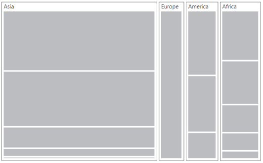

# Layout

You can decide on the visual representation of nodes belonging to all the treemap levels using the `itemsLayoutMode` property of the TreeMap.

There are four different **TreeMap** layouts such as

* Squarified
* SliceAndDiceAuto
* SliceAndDiceHorizontal
* SliceAndDiceVertical

## Squarified

**Squarified** layout creates rectangles with best aspect ratio.



<ej-treemap id="treemap"  [dataSource]="population_data" itemsLayoutMode="squarified"
                          weightValuePath= "Population"  colorValuePath= "Growth">
     <e-levels>
         <e-level groupPath="Continent" [groupGap]=5></e-level>
     </e-levels>
</ej-treemap>



## SliceAndDiceAuto

**SliceAndDiceAuto** layout creates rectangles with high aspect ratio and displays them sorted both horizontally and vertically.



<ej-treemap id="treemap"  [dataSource]="population_data" itemsLayoutMode="sliceanddiceauto"
                                 weightValuePath= "Population"  colorValuePath= "Growth">
    <e-levels>
         <e-level groupPath="Continent" [groupGap]=5></e-level>
    </e-levels>
</ej-treemap>



## SliceAndDiceHorizontal

**SliceAndDiceHorizontal** layout creates rectangles with high aspect ratio and displays them sorted horizontally.



<ej-treemap id="treemap"  [dataSource]="population_data" 
        itemsLayoutMode="sliceanddicehorizontal" weightValuePath= "Population"
        colorValuePath= "Growth">
       <e-levels>
           <e-level groupPath="Continent" [groupGap]=5></e-level>
       </e-levels>
</ej-treemap>



## SliceAndDiceVertical

**SliceAndDiceVertical** layout creates rectangles with high aspect ratio and displays them sorted vertical.



<ej-treemap id="treemap"  [dataSource]="population_data" 
       itemsLayoutMode="sliceanddicevertical" weightValuePath= "Population"
                                                  colorValuePath= "Growth">
     <e-levels>
        <e-level groupPath="Continent" [groupGap]=5></e-level>
     </e-levels>
</ej-treemap>



