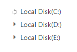

# Populate Data

TreeView can be populated with local or remote data source by using a property [dataSource](https://help.syncfusion.com/api/angular/ejtreeview#members:fields-datasource), which is the member of [fields](https://help.syncfusion.com/api/angular/ejtreeview#members:fields) property.

In TreeView, you should use “**fields**” property to go with data source. It specifies the mapping fields for the data source to receive the data, query to process the data and field mappers to map the data members.

## Fields

The following table contains the list of members with description for **fields** property.

<table>
<tr>
<th>
Properties</th><th>
Description</th></tr>
<tr>
<td>
{{'[dataSource](https://help.syncfusion.com/api/angular/ejtreeview#members:fields-datasource)'| markdownify }}  </td><td>
The data source contains the list of data for generating the TreeView list.  </td></tr>
<tr>
<td>
{{'[query](https://help.syncfusion.com/api/angular/ejtreeview#members:fields-query)'| markdownify }}  </td><td>
It specifies the query to retrieve the data from the online server.  </td></tr>
<tr>
<td>
{{'[tableName](https://help.syncfusion.com/api/angular/ejtreeview#members:fields-tablename)'| markdownify }}  </td><td>
It specifies the name of the table from which data to be processed from given data source.  </td></tr>
<tr>
<td>
{{'[id](https://help.syncfusion.com/api/angular/ejtreeview#members:fields-id)'| markdownify }}  </td><td>
It specifies the ID of the node.  </td></tr>
<tr>
<td>
{{'[parentId](https://help.syncfusion.com/api/angular/ejtreeview#members:fields-parentid)'| markdownify }}  </td><td>
It specifies the parent id of the node  </td></tr>
<tr>
<td>
{{'[text](https://help.syncfusion.com/api/angular/ejtreeview#members:fields-text)'| markdownify }}  </td><td>
It specifies the text content of the node.  </td></tr>
<tr>
<td>
{{'[hasChild](https://help.syncfusion.com/api/angular/ejtreeview#members:fields-haschild)'| markdownify }}  </td><td>
It specifies the node has child (which is the nested or inner level of nodes). Also it’s used in load on demand of tree data.  </td></tr>
<tr>
<td>
{{'[expanded](https://help.syncfusion.com/api/angular/ejtreeview#members:fields-expanded)'| markdownify }}  </td><td>
It specifies the tree node to be in expanded state  </td></tr>
<tr>
<td>
{{'[selected](https://help.syncfusion.com/api/angular/ejtreeview#members:fields-selected)'| markdownify }}  </td><td>
It specifies the select node at initialize. N> only one node get selected by default. If you enable multiple selection in TreeView then you can able to select one or more nodes at initialize.  </td></tr>
<tr>
<td>
{{'[isChecked](https://help.syncfusion.com/api/angular/ejtreeview#members:fields-ischecked)'| markdownify }}   </td><td>
It specifies the node to be in checked state, if tree node represented with checkboxes.   </td></tr>
<tr>
<td>
{{'[imageUrl](https://help.syncfusion.com/api/angular/ejtreeview#members:fields-imageurl)'| markdownify }}  </td><td>
It defines the image location.  </td></tr>
<tr>
<td>
{{'[imageAttribute](https://help.syncfusion.com/api/angular/ejtreeview#members:fields-imageattribute)'| markdownify }}  </td><td>
It defines the image attributes such as height, width, styles, etc.  </td></tr>
<tr>
<td>
{{'[spriteCssClass](https://help.syncfusion.com/api/angular/ejtreeview#members:fields-spritecssclass)'| markdownify }}  </td><td>
It defines the sprite CSS for the image tag.  </td></tr>
<tr>
<td>
{{'[htmlAttribute](https://help.syncfusion.com/api/angular/ejtreeview#members:fields-htmlattribute)'| markdownify }}  </td><td>
It defines the HTML attributes such as class and styles for a node ("li" tag).  </td></tr>
<tr>
<td>
{{'[linkAttribute](https://help.syncfusion.com/api/angular/ejtreeview#members:fields-linkattribute)'| markdownify }}  </td><td>
It defines the HTML attributes such as class and styles for a link tag, which is child of node.  </td></tr>
</table>

Mapping all fields members with corresponding key from the array of JSON data.

 



 
 
 <ej-treeview id='treeview' [fields]='fields'></ej-treeview>



N>  If you want to display nodes in Root level, exclude **parentId** attribute or specify **“0”** in corresponding value.

## Local Data

TreeView can be rendered from a self-referential data by providing the two required fields [id](https://help.syncfusion.com/api/angular/ejtreeview#members:fields-id) and [parentId](https://help.syncfusion.com/api/angular/ejtreeview#members:fields-parentid). 





Above flat array of JSON data can be directly assigned to [dataSource](https://help.syncfusion.com/api/angular/ejtreeview#members:fields-datasource) property and mapping data fields with respect to the mapper field in order to create TreeView.



<ej-treeview id='treeview' [fields]='fields'></ej-treeview>







### Nested Object Support

The nested object support is provided for the TreeView component. Please find the following JSON.



<ej-treeview id='treeview' [fields]='fields'></ej-treeview>







The above flat array of JSON data can be directly assigned to the [dataSource](https://help.syncfusion.com/api/angular/ejtreeview#members:fields-datasource) property and mapping nested data fields with respect to the mapper field to create the TreeView.

## Remote Data

When using remote data binding, the adaptor of [ej.DataManager](https://help.syncfusion.com/api/js/ejdatamanager#) plays vital role in processing queries to make them suitable to sends along with data request and also process the response data from the server.

### OData

**OData** is a standardized protocol for creating and consuming data. You can bind [oData service](http://www.odata.org/#) data to TreeView in two ways using DataManager.

* Passing OData service link to DataManager

You can provide the OData service URL directly to the [ej.DataManager](https://help.syncfusion.com/api/js/ejdatamanager#) class and then we can assign it to TreeView dataSource.



<ej-treeview id='treeview' [fields]='fields'></ej-treeview>







* Passing OData service link to “**url**” property of [ej.DataManager](https://help.syncfusion.com/api/js/ejdatamanager#)

By using “**url**” property of [ej.DataManager](https://help.syncfusion.com/api/js/ejdatamanager#) we can bind OData Service to Dropdown. Here we may also specify the **adaptor** as [ej.ODataAdaptor](https://help.syncfusion.com/js/datamanager/data-adaptors#odata-adaptor) and it is optional to specify.

We can provide adaptor value either as string value (“ODataAdaptor”) or by creating a new instance (new [ej.ODataAdaptor](https://help.syncfusion.com/js/datamanager/data-adaptors#odata-adaptor))



<ej-treeview id='treeview' [fields]='fields'></ej-treeview>







N>  We can use above code until OData service version 3. For OData Service version 4 End Point, we have created a separate adaptor [ej.ODataV4Adaptor](https://help.syncfusion.com/js/datamanager/data-binding#odata-v4) for data binding.



<ej-treeview id='treeview' [fields]='fields'></ej-treeview>







### WebApi

Using [ej.WebApiAdaptor](https://help.syncfusion.com/js/datamanager/data-adaptors#webapi-adaptor), you can bind WebApi service data to TreeView as shown in below code example



<ej-treeview id='treeview' [fields]='fields'></ej-treeview>







### Other Restful Web Services

The Custom Adaptor concept of [ej.DataManager](https://help.syncfusion.com/api/js/ejdatamanager#) allow you to customize or generate your own adaptor which is used to process query and result data. 

[https://help.syncfusion.com/js/datamanager/data-adaptors#custom-adaptor](https://help.syncfusion.com/js/datamanager/data-adaptors#custom-adaptor)



<ej-treeview id='treeview' [fields]='fields'></ej-treeview>







## Load on Demand

Load on demand is a technique (Lazy load) that is used to reduce the bandwidth size of consuming huge data. You can load data on demand in TreeView by using [loadOnDemand](https://help.syncfusion.com/api/angular/ejtreeview#members:loadOnDemand) property when you’re going to use huge data.

For local data source, TreeView loads the first level nodes initially. While expand a parent node then TreeView loads it’s their child nodes from the data source based on the parentId member. It reduces the time to render TreeView with huge data.

Refer below code example to load data on demand from local data source.



<ej-treeview id='treeview' [fields]='fields' [loadOnDemand]='loadOnDemand'></ej-treeview>







The following screenshot displays the load on demand for local data source in TreeView control.

While expanding the parent node
{:.caption}

After expanding the parent node
{:.caption}