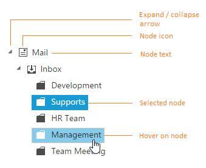

# Tree Node

TreeView node is structured with expand/collapse arrow, checkbox, image and text as shown in below.

Also TreeView node object holds the following properties.

<table>
<tr>
<th>
Properties</th><th>
Data Type</th><th>
Description</th></tr>
<tr>
<td>
checked   </td><td>
Boolean  </td><td>
Checked state of the node  </td></tr>
<tr>
<td>
count  </td><td>
Number  </td><td>
Number of child  </td></tr>
<tr>
<td>
expanded  </td><td>
Boolean  </td><td>
Expanded state of the node  </td></tr>
<tr>
<td>
index  </td><td>
Number  </td><td>
Index of the node   </td></tr>
<tr>
<td>
level  </td><td>
Number  </td><td>
Level of the node  </td></tr>
<tr>
<td>
id  </td><td>
String  </td><td>
Node id  </td></tr>
<tr>
<td>
parentId  </td><td>
String  </td><td>
Parent id of the node  </td></tr>
<tr>
<td>
selected  </td><td>
Boolean  </td><td>
Selected state of the node  </td></tr>
</table>

## Node Manipulations

You can perform following operation in tree nodes and the modified node values can be saved in database.

### Expand or Collapse node

Tree nodes can be expanded or collapsed by clicking the expand/collapse icon of the node or in code behind by using the following methods.

<table>
<tr>
<th>
Methods</th><th>
Description</th></tr>
<tr>
<td>
{{'[expandNode](http://help.syncfusion.com/api/js/ejtreeview#methods:expandnode)'| markdownify }}   </td><td>
Expands the node with specified id  </td></tr>
<tr>
<td>
{{'[collapseNode](http://help.syncfusion.com/api/js/ejtreeview#methods:collapsenode)'| markdownify }}  </td><td>
Collapse the node with specified id   </td></tr>
<tr>
<td>
{{'[expandAll](http://help.syncfusion.com/api/js/ejtreeview#methods:expandall)'| markdownify }}  </td><td>
Expands all the node  </td></tr>
<tr>
<td>
{{'[collapseAll](http://help.syncfusion.com/api/js/ejtreeview#methods:collapseall)'| markdownify }}  </td><td>
Collapse all the node  </td></tr>
</table>
Also you can get all the expanded nodes index in tree by using [getExpandedNodesIndex](http://help.syncfusion.com/api/js/ejtreeview#methods:getexpandednodesindex) method, which returns the array of expanded node indices. 

## Editing

You can directly edit the tree node’s text in-place by double-click on the tree node or select the tree node and press F2 key. The editing works only if the [allowEditing](http://help.syncfusion.com/api/angular/ejtreeview#members:allowediting) property is true in TreeView control. When editing is completed by focus out or “enter” key press, the modified node’s text is saved automatically. The [nodeEdit](https://help.syncfusion.com/api/angular/ejtreeview#events:nodeedit) event will be triggered whenever edited the TreeView node.
Also [beforeEdit](https://help.syncfusion.com/api/angular/ejtreeview#events:beforeedit) event will be triggered before the TreeView node change into editing mode.



// Initialize and bind the TreeView with allowEditing property

 <ej-treeview id="dragdrop" [fields]='field' [allowEditing]='allowediting'></ej-treeview>





<script>

import { Component, Inject } from '@angular/core';

@Component({
    selector: 'control-content',
    templateUrl: 'app/components/treeview/editing.component.html'
})
export class editingTreeViewComponent {

   public hierarchicalData: Object[] = [
        {
            id: 1, name: 'ASP.NET MVC Team', expanded: true,
            child: [
                { id: 2, parentId: 1, name: 'Smith', isSelected: true },
                { id: 3, parentId: 1, name: 'Johnson', isSelected: true },
                { id: 4, parentId: 1, name: 'Anderson' },
            ]
        },
        {
            id: 5, name: 'Windows Team',
            child: [
                { id: 6, parentId: 5, name: 'Clark' },
                { id: 7, parentId: 5, name: 'Wright' },
                { id: 8, parentId: 5, name: 'Lopez' },
            ]
        },
        {
            id: 9, name: 'Web Team',
            child: [
                { id: 11, parentId: 9, name: 'Joshua' },
                { id: 12, parentId: 9, name: 'Matthew' },
                { id: 13, parentId: 9, name: 'David' },
            ]
        },
        {
            id: 14, name: 'Build Team',
            child: [
                { id: 15, parentId: 14, name: 'Ryan' },
                { id: 16, parentId: 14, name: 'Justin' },
                { id: 17, parentId: 14, name: 'Robert' },
            ]
        },
        {
            id: 18, name: 'WPF Team',
            child: [
                { id: 19, parentId: 18, name: 'Brown' },
                { id: 20, parentId: 18, name: 'Johnson' },
                { id: 21, parentId: 18, name: 'Miller' },
            ]
        }
    ];
    public field:Object ={ dataSource: this.hierarchicalData, id: 'id', text: 'name', child: 'child', selected: 'isSelected' };
    public allowEditing:boolean = true;
}

<script>



