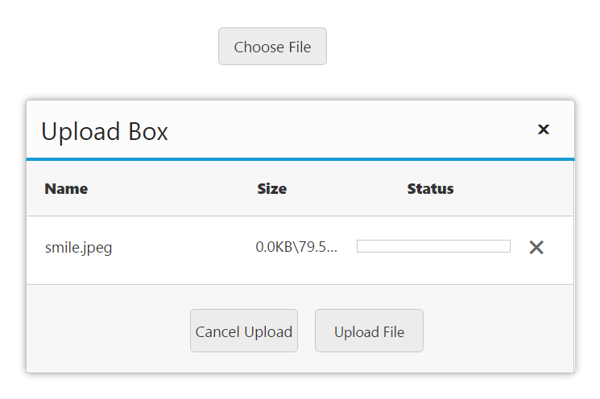
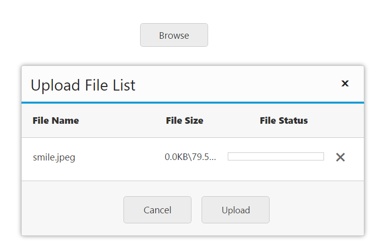
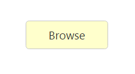

# Appearance and styling 

The **Uploadbox** widget provides support to customize the **dialog box** text and **button** text. 

## Customizing Button Text

The following table contains the **sub properties** available under [buttonText](https://help.syncfusion.com/api/js/ejuploadbox#members:buttontext) property. To customize the text, pass the alternate text with corresponding **sub properties**. 

Sub-properties under buttonText property

<table>
<tr>
<th>
Name</th><th>
Description</th><th>
Data Type</th></tr>
<tr>
<td>
browse</td><td>
Sets the alternative text for browse button. </td><td>
String</td></tr>
<tr>
<td>
upload</td><td>
Sets the alternative text for upload button. </td><td>
String</td></tr>
<tr>
<td>
cancel</td><td>
Sets the alternative text for cancel button. </td><td>
String</td></tr>
</table>

The following code helps you for the configuration of **buttonText** property in **Uploadbox**. 



	<ej-uploadbox id="UploadDefault" [saveUrl]="saveURL" [removeUrl]="removeURL" [buttonText.browse]="browse" [buttonText.upload]="upload" [buttonText.cancel]="cancel"></ej-uploadbox>





 import {Component} from '@angular/core';
    @Component({
    selector: 'ej-app',
        templateUrl: 'app/components/uploadbox/uploadbox.component.html'
    })
    export class UploadBoxComponent {
        saveURL: string;
        removeURL: string;
        browse: string;
        upload: string;
        cancel: string;
        constructor() {
        this.saveURL = '../saveFiles.ashx';
        this.saveURL = '../removeFiles.ashx';
        this.browse = "Choose File";
        this.upload = "Upload File";
        this.cancel = "Cancel Upload";
        }
    }



Configure **saveFiles.ashx** and **removeFiles.ashx** files as mentioned in the Save file action and Remove file action respectively.

The following screenshot displays the output.

 

## Customizing Upload Dialog

The following table contains the **sub properties** available under [Uploadbox’s DialogText](https://help.syncfusion.com/api/js/ejuploadbox#members:dialogtext) property. To customize the text, pass the alternate text with corresponding **sub properties**. 

Sub properties under dialogText property.

<table>
<tr>
<th>
Name</th><th>
Description</th></tr>
<tr>
<td>
title</td><td>
Sets the alternative text for Title of <b>Uploadbox</b> dialog. </td></tr>
<tr>
<td>
name</td><td>
Sets the alternative text for Name column.  </td></tr>
<tr>
<td>
size</td><td>
Sets the alternative text for Size column. </td></tr>
<tr>
<td>
status</td><td>
Sets the alternative text for status column.</td></tr>
</table>

The following code helps you for the configuration of [dialogText](https://help.syncfusion.com/api/js/ejuploadbox#members:dialogtext) property in **Uploadbox**. 



	<ej-uploadbox id="UploadDefault" [saveUrl]="saveURL" [removeUrl]="removeURL" [dialogText.title]="title" [dialogText.name]="name" [dialogText.size]="size" [dialogText.status]="status"></ej-uploadbox>





 import {Component} from '@angular/core';
    @Component({
    selector: 'ej-app',
        templateUrl: 'app/components/uploadbox/uploadbox.component.html'
    })
    export class UploadBoxComponent {
        saveURL: string;
        removeURL: string;
        title: string;
        name: string;
        size: string;
        status: string
        constructor() {
        this.saveURL = '../saveFiles.ashx';
        this.saveURL = '../removeFiles.ashx';
        this.title = "Upload File List";
        this.name = "File Name";
        this.size = "File Size";
        this.status = "File Status";
        }
    }



Configure **saveFiles.ashx** and **removeFiles.ashx** files as mentioned in the Save file action and Remove file action respectively. 

The following screenshot displays the output.

 

## Show or Hide File details 

You have an option to **show** or **hide** **file** **details** in the **uploaded file list** **dialog**. By using this property, the **uploaded file dialog** does not display the file details once selected. To enable this, set [showFileDetails](https://help.syncfusion.com/api/js/ejuploadbox#members:showfiledetails) to ‘**false**’. By default, its value is set to ‘**true**’. The data type is **Boolean**.

The following code helps you for the configuration of [showFileDetails](https://help.syncfusion.com/api/js/ejuploadbox#members:showfiledetails) property in **Uploadbox**.



	<ej-uploadbox id="UploadDefault" [saveUrl]="saveURL" [removeUrl]="removeURL" [showFileDetails]="false"></ej-uploadbox>





 import {Component} from '@angular/core';
    @Component({
    selector: 'ej-app',
        templateUrl: 'app/components/uploadbox/uploadbox.component.html'
    })
    export class UploadBoxComponent {
        saveURL:string;
        removeURL:string;
        constructor() {
        this.saveURL = '../saveFiles.ashx';
        this.saveURL = '../removeFiles.ashx';
        }
    }



Configure **saveFiles.ashx** and **removeFiles.ashx** files as mentioned in the Save file action and Remove file action respectively.

## Theme

**Uploadbox** control’s style and appearance are controlled based on **CSS** classes. In order to apply styles to the **Uploadbox** control, you can refer to two files namely, **ej.widgets.core.min.css** and **ej.theme.min.css**. When the file **ej.widgets.all.min.css** is referred, then it is not necessary to include the files **ej.widgets.core.min.css** and **ej.theme.min.css** in your project**,** as **ej.widgets.all.min.css** is the combination of these both files. 

By default, there are 12-theme support available for **Uploadbox** control namely,

* Default-theme
* Flat-azure-dark
* Fat-lime
* Flat-lime-dark
* Flat-saffron
* Flat-saffron-dark
* Gradient-azure
* Gradient-azure-dark
* Gradient-lime
* Gradient-lime-dark
* Gradient-saffron
* Gradient-saffron-dark

## Custom CSS

**CSS** **class** customizes the **Uploadbox** control’s appearance. Define a **CSS** **class** as per the requirement and assign the class name to **cssClass** property. The data type is **string**. 

The following steps explain the configuration of [cssClass](https://help.syncfusion.com/api/js/ejuploadbox#members:cssclass) property in **Uploadbox**. 

In the **HTML** page, add the **&lt;div&gt;** element to configure the **Uploadbox** element.



	<ej-uploadbox id="UploadDefault" [saveUrl]="saveURL" [removeUrl]="removeURL" cssClass="customcss"></ej-uploadbox>




   
 import {Component} from '@angular/core';
 import {ViewEncapsulation} from '@angular/core';
    @Component({
    selector: 'ej-app',
        templateUrl: 'app/components/uploadbox/uploadbox.component.html',
        styleUrls: ['app/components/uploadbox/uploadbox.component.css'],
        encapsulation: ViewEncapsulation.None
    })
    export class UploadBoxComponent {
        saveURL:string;
        removeURL:string;
        constructor() {
        this.saveURL = '../saveFiles.ashx';
        this.saveURL = '../removeFiles.ashx';
        }
    }



 In **CSS**, configure Custom Styles for the **Uploadbox** in uploadbox.component.css file.



  .customcss.e-uploadbox.e-widget .e-selectpart.e-select{
        background-color: #FFFFCC;
        font-weight: bold; 
        font-family: sans-serif;
    }



Configure **saveFiles.ashx** and **removeFiles.ashx** files as mentioned in the Save file action and Remove file action respectively.

The following screenshot displays the output.

