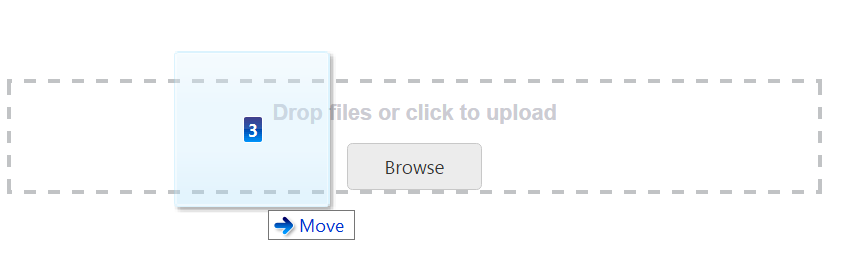
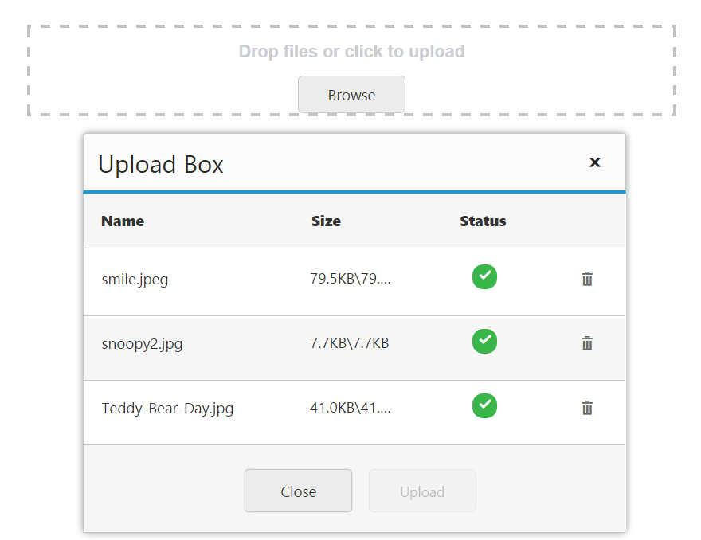
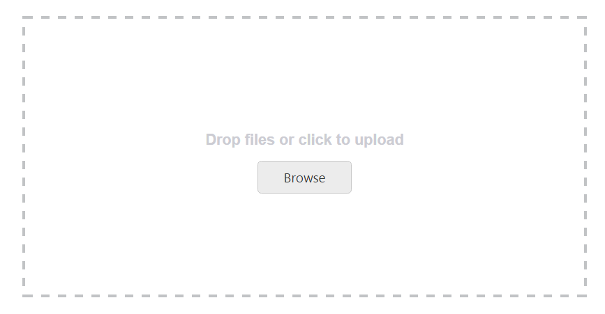

# Drag and Drop Support

The **Uploadbox** control provides the drag and drop support. You can simply drag-and-drop files, directly from the computer and can be dropped into the droppable area. A list of files can be dragged and dropped when you enable the [multipleFilesSelection](https://help.syncfusion.com/api/js/ejuploadbox#members:multiplefilesselection).

The following screenshot displays the drag and drop support.

 

## Enable drag and drop 

You can enable or disable drag and drop by using the [allowDragAndDrop](https://help.syncfusion.com/api/js/ejuploadbox#members:allowdraganddrop) property. By default, the **allowDragAndDrop** property is set as **false** in the **Uploadbox** control. You can enable drag and drop by setting the [allowDragAndDrop](https://help.syncfusion.com/api/js/ejuploadbox#members:allowdraganddrop) property as **true**. When you want to drag and drop multiple files, you can enable multiple file selection by setting **multipleFilesSelection** as **true** in the **Uploadbox** control.

The following code helps that how to enable the drag and drop in the **Uploadbox** control.



	

		<ej-uploadbox id="UploadDefault" [saveUrl]="saveURL" [removeUrl]="removeURL" [allowDragAndDrop]="true"></ej-uploadbox>
	





 import {Component} from '@angular/core';
 import {ViewEncapsulation} from '@angular/core';
    @Component({
    selector: 'ej-app',
        templateUrl: 'app/components/uploadbox/uploadbox.component.html',
        styleUrls: ['app/components/uploadbox/uploadbox.component.css'],
        encapsulation: ViewEncapsulation.None
    })
    export class UploadBoxComponent {
        saveURL:string;
        removeURL:string;
        constructor() {
        this.saveURL = '../saveFiles.ashx';
        this.saveURL = '../removeFiles.ashx';
        }
    }



Configure the custom styles for drag and drop in uploadbox.component.css file.



    .frame {
        width: 500px;
        height: 100px;
        margin-top: 10%;
    }

    .control {
        width: 100%;
        height: 100%;
    }



The following screenshot displays the output for the above code.

 

## Drag Area text

You can change the drag area text by using the **dragAreaText** property.  By default, the **dragAreaText** (string) property is **Drop files or click to upload** in the Uploadbox control. You can refer to the below code.



	

		<ej-uploadbox id="UploadDefault" [saveUrl]="saveURL" [removeUrl]="removeURL" [allowDragAndDrop]="true" [dropAreaText]="text"></ej-uploadbox>
	





 import {Component} from '@angular/core';
 import {ViewEncapsulation} from '@angular/core';
    @Component({
    selector: 'ej-app',
        templateUrl: 'app/components/uploadbox/uploadbox.component.html',
        styleUrls: ['app/components/uploadbox/uploadbox.component.css'],
        encapsulation: ViewEncapsulation.None
    })
    export class UploadBoxComponent {
        saveURL:string;
        removeURL:string;
        text: string;
        constructor() {
        this.saveURL = '../saveFiles.ashx';
        this.saveURL = '../removeFiles.ashx';
        this.text = "drop files here";
        }
    }



Configure the custom styles for drag and drop in uploadbox.component.css file.



    .frame {
        width: 500px;
        height: 100px;
        margin-top: 10%;
    }

    .control {
        width: 100%;
        height: 100%;
    }



The following screenshot displays the output for the above code.

 

## Adjust Drop area size

The **Uploadbox** control provides the ability to change or adjust the drop area size. The [dropAreaHeight](https://help.syncfusion.com/api/js/ejuploadbox#members:dropareaheight) and [dropAreaWidth](https://help.syncfusion.com/api/js/ejuploadbox#members:dropareawidth) properties in the **Uploadbox** control allows you to set the maximum height and maximum width for the drop area. The value set to this property is **string** or **number** type.

The following code helps you that how to adjust the Drop Area Size.



    <ej-uploadbox id="UploadDefault" [saveUrl]="saveURL" [removeUrl]="removeURL" [allowDragAndDrop]="true" [dropAreaHeight]="height" [dropAreaWidth]="width"></ej-uploadbox>





 import {Component} from '@angular/core';
 import {ViewEncapsulation} from '@angular/core';
    @Component({
    selector: 'ej-app',
        templateUrl: 'app/components/uploadbox/uploadbox.component.html',
        styleUrls: ['app/components/uploadbox/uploadbox.component.css'],
        encapsulation: ViewEncapsulation.None
    })
    export class UploadBoxComponent {
        saveURL:string;
        removeURL:string;
        height: any;
        width: any;
        constructor() {
        this.saveURL = '../saveFiles.ashx';
        this.saveURL = '../removeFiles.ashx';
        this.height = "300px";
        this.width = "600px";
        }
    }



The following screenshot displays the output for the above code.

 

## Drop area with Browse button behavior

You can click anywhere in the droppable area to browse and upload the files. The droppable area behaves like a browse button.

### Droppable area behavior

Enable the **allowDragAndDrop** property to achieve this feature. Next, set the [showBrowseButton](https://help.syncfusion.com/api/js/ejuploadbox#members:showbrowsebutton) as **false** in Uploadbox Control.

The following code helps you that droppable area containing the browse button behavior.



	

		<ej-uploadbox id="UploadDefault" [saveUrl]="saveURL" [removeUrl]="removeURL" [allowDragAndDrop]="true" [multipleFilesSelection]="true" [showBrowseButton]="false"></ej-uploadbox>
	





 import {Component} from '@angular/core';
 import {ViewEncapsulation} from '@angular/core';
    @Component({
    selector: 'ej-app',
        templateUrl: 'app/components/uploadbox/uploadbox.component.html',
        styleUrls: ['app/components/uploadbox/uploadbox.component.css'],
        encapsulation: ViewEncapsulation.None
    })
    export class UploadBoxComponent {
        saveURL:string;
        removeURL:string;
        constructor() {
        this.saveURL = '../saveFiles.ashx';
        this.saveURL = '../removeFiles.ashx';
        }
    }



Configure the custom styles for drag and drop in uploadbox.component.css file.



    .frame {
        width: 500px;
        height: 100px;
        margin-top: 10%;
    }

    .control {
        width: 100%;
        height: 100%;
    }



The following screenshot displays the output for the above code.

