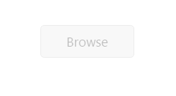

# Enables or Disables the Uploadbox 

This feature helps set the **enable** or **disable** option for **Uploadbox** by setting **Boolean** type value to [enabled](https://help.syncfusion.com/api/js/ejuploadbox#members:enabled) property. For **enable** or **disable** option, set [enabled](https://help.syncfusion.com/api/js/ejuploadbox#members:enabled) property to ‘**false**’. The data type is **Boolean**.

The following code explains you for the configuration of **enabled** property in **Uploadbox**. 



<ej-uploadbox id="UploadDefault" [saveUrl]="saveURL" [removeUrl]="removeURL" [enabled]="false"></ej-uploadbox>





 import {Component} from '@angular/core';
    @Component({
    selector: 'ej-app',
        templateUrl: 'app/components/uploadbox/uploadbox.component.html'
    })
    export class UploadBoxComponent {
        saveURL:string;
        removeURL:string;
        constructor() {
        this.saveURL = '../saveFiles.ashx';
        this.saveURL = '../removeFiles.ashx';
        }
    }



Configure **saveFiles.ashx** and **removeFiles.ashx** files as mentioned in the Save file action and Remove file action respectively.

The following screenshot displays the output.

