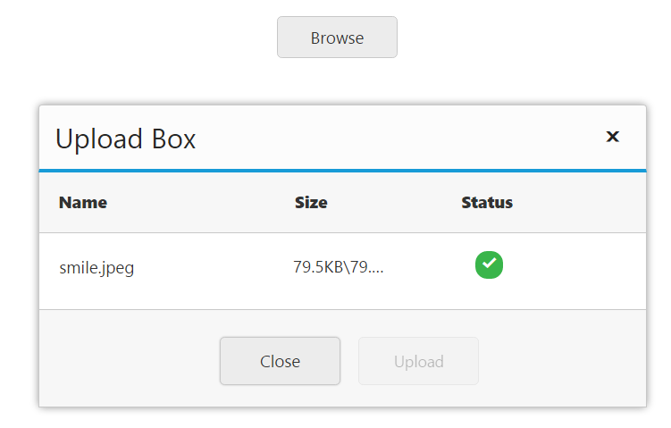
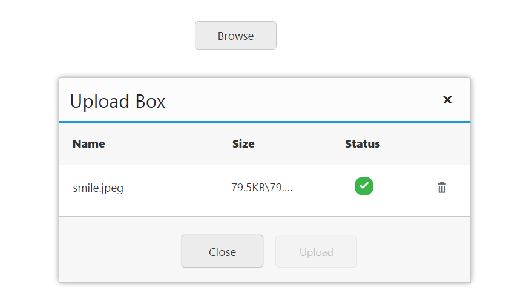
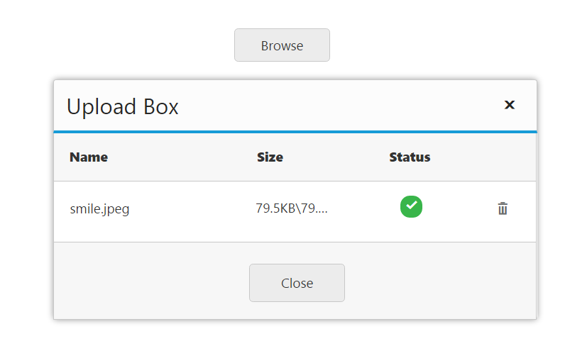

# File Actions

## Save File Action 

To save the uploaded file in **JS**, create the handler class and trigger the same in [saveUrl](https://help.syncfusion.com/api/js/ejuploadbox#members:saveurl) property.  In that handler, save and specify the target location for uploaded files. The data type is **string**.

The following code helps you for the configuration of [saveUrl](https://help.syncfusion.com/api/js/ejuploadbox#members:saveurl) property in the **Uploadbox**. 



<ej-uploadbox id="UploadDefault" [saveUrl]="saveURL"></ej-uploadbox>




    
    import {Component} from '@angular/core';
    @Component({
    selector: 'ej-app',
        templateUrl: 'app/components/uploadbox/uploadbox.component.html'
    })
    export class UploadBoxComponent {
        saveURL:string;
        removeURL:string;
        constructor() {
        this.saveURL = '../saveFiles.ashx';
        }
    }



Configure the handler to save the file. Create a folder (for example,files) and save the uploaded files into this folder.  



saveFiles.ashx 

    public class saveFiles : IHttpHandler {

    public void ProcessRequest(HttpContext context)
    {
        string targetFolder = HttpContext.Current.Server.MapPath("files");
        if (!Directory.Exists(targetFolder))
        {
            Directory.CreateDirectory(targetFolder);
        }
        HttpRequest request = context.Request;
            HttpFileCollection uploadedFiles = context.Request.Files;
            if (uploadedFiles != null && uploadedFiles.Count > 0)
            {
                for (int i = 0; i < uploadedFiles.Count; i++)
                {
                    string fileName = uploadedFiles[i].FileName;
                    int index = fileName.LastIndexOf("\\");
                    if (index > -1)
                    {
                        fileName = fileName.Substring(index + 1);
                    }
                    uploadedFiles[i].SaveAs(targetFolder + "\\" + fileName);
                }
            }
    }
    public bool IsReusable
    {
        get
        {
            return false;
        }
    }
}



The following screenshot displays the output. 

 

## Remove File Action 

To **remove** the uploaded file in **JS**, create a handler class and trigger the same in [removeUrl](https://help.syncfusion.com/api/js/ejuploadbox#members:removeurl) property.  The uploaded file has to be removed from the handler where the file is saved. This is achieved by clicking **remove** button on **upload** dialog. The data type is **string**.

The following code helps you for the configuration of **removeUrl** property in **Uploadbox**. 



<ej-uploadbox id="UploadDefault" [removeUrl]="removeURL"></ej-uploadbox>





 import {Component} from '@angular/core';
    @Component({
    selector: 'ej-app',
        templateUrl: 'app/components/uploadbox/uploadbox.component.html'
    })
    export class UploadBoxComponent {
        saveURL:string;
        removeURL:string;
        constructor() {
        this.saveURL = '../removeFiles.ashx';
        }
    }



Configure the handlers to remove the file from the target location. From that location, the file is searched and removed from the ‘**files’** folder.



removeFiles.ashx

    public class removeFiles : IHttpHandler
     {

    public void ProcessRequest(HttpContext context)
    {
        System.Collections.Specialized.NameValueCollection s = context.Request.Params;
        string fileName = s["fileNames"];
        string targetFolder = HttpContext.Current.Server.MapPath("files");
        if (!Directory.Exists(targetFolder))
        {
            Directory.CreateDirectory(targetFolder);
        }

        string physicalPath = targetFolder + "\\" + fileName;
        if (System.IO.File.Exists(physicalPath))
        {
            System.IO.File.Delete(physicalPath);
        }

    }
    public bool IsReusable
    {
        get
        {
            return false;
        }
    }
  }



The following screenshot displays the output. 

 

##  Auto Upload

The **Uploadbox** widget provides support to upload the file automatically once file is selected by using browse button, that is, without clicking upload button. To achieve this, set the [autoUpload](https://help.syncfusion.com/api/js/ejuploadbox#members:autoupload) property to ‘**true**’. The data type is **Boolean**. By default, the value is set to ‘**false**’, so **upload** button is clicked to upload the files. 

The following code helps you for the configuration of [autoUpload](https://help.syncfusion.com/api/js/ejuploadbox#members:autoupload) property in **Uploadbox**



<ej-uploadbox id="UploadDefault" [saveUrl]="saveURL" [removeUrl]="removeURL" [autoUpload]="true"></ej-uploadbox>





 import {Component} from '@angular/core';
    @Component({
    selector: 'ej-app',
        templateUrl: 'app/components/uploadbox/uploadbox.component.html'
    })
    export class UploadBoxComponent {
        saveURL:string;
        removeURL:string;
        constructor() {
        this.saveURL = '../saveFiles.ashx';
        this.saveURL = '../removeFiles.ashx';
        }
    }



Configure **saveFiles.ashx** and **removeFiles.ashx** files as mentioned in the Save file action and Remove file action respectively. 

The following screenshot displays the output.

