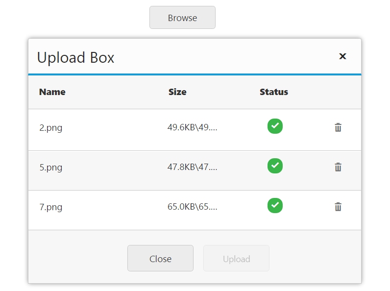

# Multiple files upload

The **Uploadbox** widget provides support to upload multiple files spontaneously. The [multipleFilesSelection](https://help.syncfusion.com/api/js/ejuploadbox#members:multiplefilesselection) property enables you to select multiple files while browsing.  To achieve this, set the [multipleFilesSelection](https://help.syncfusion.com/api/js/ejuploadbox#members:multiplefilesselection) property to ‘**true**’. The data type is **Boolean**.

N> The Multiple file selection supports all the latest versions of browser except Internet Explorer 9 and its previous versions.

The following code helps for the configuration of **multipleFilesSelection** property in **Uploadbox**. 



<ej-uploadbox id="UploadDefault" [saveUrl]="saveURL" [removeUrl]="removeURL" [multipleFilesSelection]="true"></ej-uploadbox>





 import {Component} from '@angular/core';
    @Component({
    selector: 'ej-app',
        templateUrl: 'app/components/uploadbox/uploadbox.component.html'
    })
    export class UploadBoxComponent {
        saveURL:string;
        removeURL:string;
        constructor() {
        this.saveURL = '../saveFiles.ashx';
        this.saveURL = '../removeFiles.ashx';
        }
    }



Configure **saveFiles.ashx** and **removeFiles.ashx** files as mentioned in the Save file action and Remove file action respectively.

The following screenshot displays the output.

