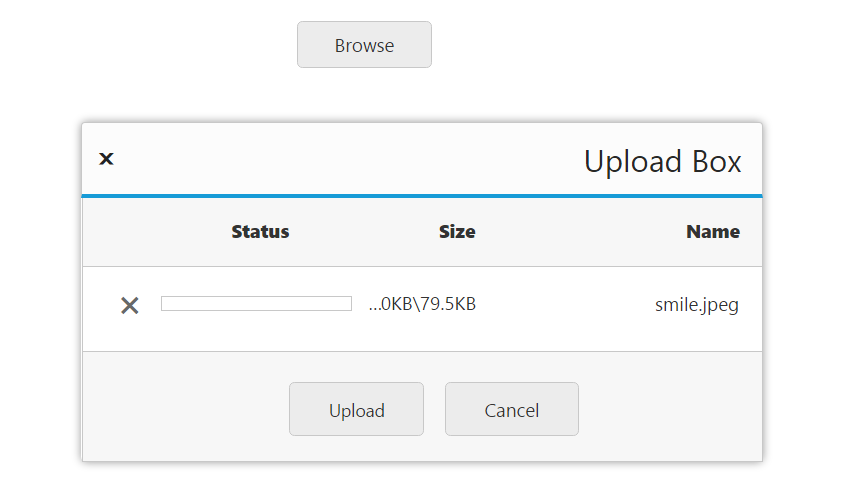

# RTL Support 

This feature supports the change of left-to-right alignment of the **Uploadbox** widget to right-to-left (**RTL**). That is, it sets the **Uploadbox** to right-to-left actions.

he following code helps you for the configuration of [enableRTL](https://help.syncfusion.com/api/js/ejuploadbox#members:enablertl) property in **Uploadbox**. 



	<ej-uploadbox id="UploadDefault" [saveUrl]="saveURL" [removeUrl]="removeURL" [enableRTL]="true"></ej-uploadbox>





 import {Component} from '@angular/core';
    @Component({
    selector: 'ej-app',
        templateUrl: 'app/components/uploadbox/uploadbox.component.html'
    })
    export class UploadBoxComponent {
        saveURL:string;
        removeURL:string;
        constructor() {
        this.saveURL = '../saveFiles.ashx';
        this.saveURL = '../removeFiles.ashx';
        }
    }



Configure **saveFiles.ashx** and **removeFiles.ashx** files as mentioned in the Save file action and Remove file action respectively.

The following screenshot displays the output.

 