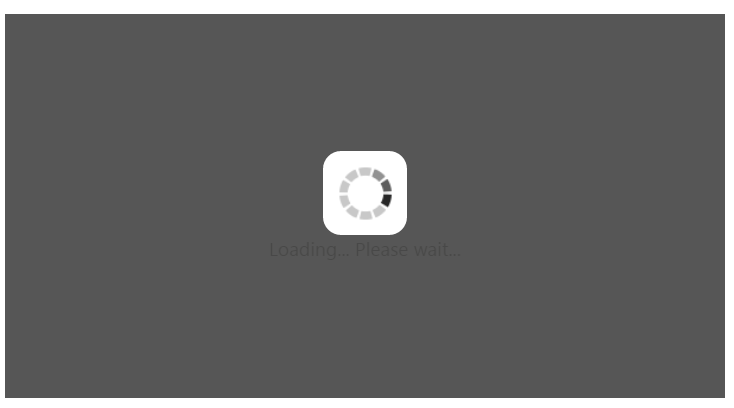
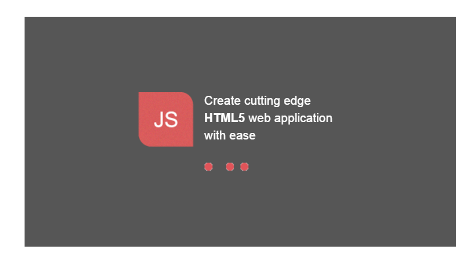
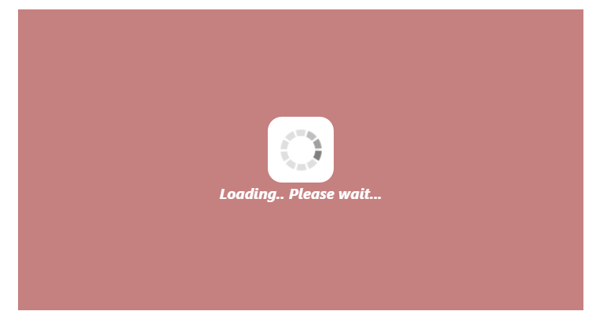

# Appearance and Styling 

## Custom Text

**WaitingPopup** control provides support for Custom Text to mention any message inside the pop-up panel. You can specify a custom text through the [text](https://help.syncfusion.com/api/js/ejwaitingpopup#members:text) property that displays when the **WaitingPopup** is loading.

The following code helps you for the configuration of custom text in **WaitingPopup** control.



    <ej-waitingpopup id="waitingPopUp" [target]="target" [showOnInit]="true" [text]="text"></ej-waitingpopup>





import {Component} from '@angular/core';
import {ViewEncapsulation} from '@angular/core'; 
@Component({
    selector: 'sd-home',
    templateUrl: 'app/components/waitingpopup/waitingpopup.component.html',
    styleUrls: ['app/components/waitingpopup/waitingpopup.component.css'],
    encapsulation: ViewEncapsulation.None
    })
    export class WaitingPopupComponent { 
        text: string;
        target: string;
        constructor(){
            this.text="Loading... Please wait...";
            this.target = "#parent";
        }     
    }



 Add the following styles to render **WaitingPopup** widget in waitingpopup.component.css.



   #parent {
       height: 320px;
       width: 600px;
   }



Execute the above code to render the following output.

 

## Template

We can customize the appearance of **WaitingPopup** widget using [template](https://help.syncfusion.com/api/js/ejwaitingpopup#members:template) support which is used to include the **HTML** content instead of the default image.

The following code helps you that how to display a text and image using template for **WaitingPopup** control.



	<ej-waitingpopup id="target" [target]="target" [showOnInit]="true" [template]="template"></ej-waitingpopup>  



 Add customized template for **WaitingPopup** control using the following code example.



   

      

      

         
Create cutting edge 

         
<b>HTML5</b> web application 

         
with ease 

      

   

   



Initialize the **WaitingPopup** with custom template using the following code example.



import {Component} from '@angular/core';
import {ViewEncapsulation} from '@angular/core'; 
@Component({
    selector: 'sd-home',
    templateUrl: 'app/components/waitingpopup/waitingpopup.component.html',
    styleUrls: ['app/components/waitingpopup/waitingpopup.component.css'],
    encapsulation: ViewEncapsulation.None
    })
    export class WaitingPopupComponent { 
        template: string;
        target: string;
        constructor() {
            this.target = "#parent";
            this.template = "#content";
        }   
    }



In **CSS**, you can configure the custom styles for **WaitingPopup**.

N> Images for this sample are available ‘installed sample location /images/waitingPopup’ and we need to define images in mentioned CSS. Henceforth the images will display.



   #parent {
       height: 320px;
       width: 600px;
       margin: 0 auto;
   }
   .block {
    height: 76px;
   }
   .logo {
       background-image: url("../images/waitingPopup/js_logo.png");
       float: left;
       height: 100%;
       width: 77px;
       margin-right: 15px;
   }
   .txt {
       float: left;
       font-size: 17px;
       height: 100%;
       text-align: left;
   }
   .txt p {
       margin: 0;
   }
   .loader {
       background: url("../images/waitingPopup/load_light.gif") no-repeat scroll -5px 18px transparent;
       height: 40px;
       width: 100%;
   }
   #content {
       cursor: default;
       height: 112px;
       width: 275px;
       color:white;
   }



Execute the above code to render the following output.

 

## CSS Class

You can use the **CSS** class to customize the **WaitingPopup** control appearance. Define a **CSS** class as per requirement and assign the class name to [cssClass](https://help.syncfusion.com/api/js/ejwaitingpopup#members:cssclass) property.

The following code helps to configure **CSS** class for an auto-complete textbox.



    <ej-waitingpopup id="waitingPopUp" [target]="target" cssClass="customcss" [showOnInit]="true" [text]="text"></ej-waitingpopup>

  





import {Component} from '@angular/core';
import {ViewEncapsulation} from '@angular/core'; 
@Component({
    selector: 'sd-home',
    templateUrl: 'app/components/waitingpopup/waitingpopup.component.html',
    styleUrls: ['app/components/waitingpopup/waitingpopup.component.css'],
    encapsulation: ViewEncapsulation.None
    })
    export class WaitingPopupComponent { 
        text: string;
        target: string;
        constructor(){
            this.text="Loading... Please wait...";
            this.target = "#parent";
        }     
    }



Define CSS class for customizing the WaitingPopup widget.



   /*Customize the panel property*/
   #parent {
       height: 320px;
       width: 600px;
       margin: 0 auto;
   }
   /* Customize the WaitingPopup */
  .customcss{
    background-color: darkred;
    font-style: italic;
    font-weight: bolder;
    opacity: 0.5;		
    color: white;
  }



The following screenshot displays the output for the above code.

 