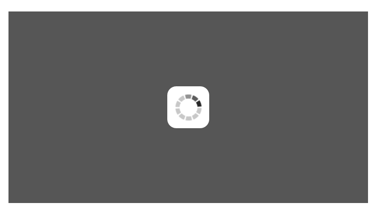
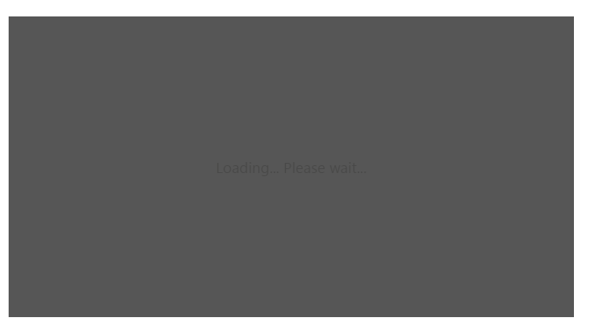
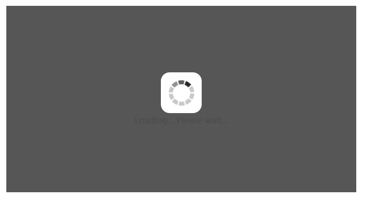

# Behavior and Settings

## Automatic Initializing WaitingPopup widget

**WaitingPopup** widget contains [showOnInit](https://help.syncfusion.com/api/js/ejwaitingpopup#members:showoninit) property that allows the popup to display over a target on page load automatically. By default, **showOnInit** property is set as false.

The following code helps you on how to display the **WaitingPopup** on page load.



    <ej-waitingpopup id="waitingPopUp" [target]="target" [showOnInit]="true"></ej-waitingpopup>  





import {Component} from '@angular/core';
import {ViewEncapsulation} from '@angular/core'; 
@Component({
    selector: 'sd-home',
    templateUrl: 'app/components/waitingpopup/waitingpopup.component.html',
    styleUrls: ['app/components/waitingpopup/waitingpopup.component.css'],
    encapsulation: ViewEncapsulation.None
    })
    export class WaitingPopupComponent {
        target: string;
        constructor() {
            this.target = "#parent";
        }                        
    }



 Add the following styles to render **WaitingPopup** widget in waitingpopup.component.css.



 #parent {
    height: 320px;
    width: 600px;
 }



The following screenshot illustrates the **WaitingPopup** when **showOnInit** is set to “**true**”.

 

## Enable / Disable Popup Indicator

You can show or hide the popup indicator of **WaitingPopup** widget using [showImage](https://help.syncfusion.com/api/js/ejwaitingpopup#members:showimage) property. By default, **showImage** property is set as **true**.

The following code helps you to enable / disable popup indicator in **WaitingPopup** widget.



// To configure Enable / Disable popup indicator in WaitingPopup, use the following code.
    //Enable popup indicator:
    

        <ej-waitingpopup id="waitingPopUp" [target]="target" [showOnInit]="true" [showImage]="true" [text]="text"></ej-waitingpopup>  
    
  
    
   //Disable popup indicator:
    

        <ej-waitingpopup id="waitingPopUp" [target]="target" [showOnInit]="true" [showImage]="false" [text]="text"></ej-waitingpopup>  
   
  




import {Component} from '@angular/core';
import {ViewEncapsulation} from '@angular/core'; 
@Component({
    selector: 'sd-home',
    templateUrl: 'app/components/waitingpopup/waitingpopup.component.html',
    styleUrls: ['app/components/waitingpopup/waitingpopup.component.css'],
    encapsulation: ViewEncapsulation.None
    })
    export class WaitingPopupComponent { 
        text: string;
        target: string;
        constructor(){
            this.text="Loading... Please wait...";
            this.target = "#parent";
        }                        
    }



Add the following styles to render **WaitingPopup** widget in waitingpopup.component.css.



  #parent {
    height: 320px;
    width: 600px;
  }



Execute the above code to render the following output.

 

 

## Show / Hide WaitingPopup

Using [show()](https://help.syncfusion.com/api/js/ejwaitingpopup#methods:show) and [hide()](https://help.syncfusion.com/api/js/ejwaitingpopup#methods:hide) methods, you can display or hide the **WaitingPopup** widget over the target area.

The following code helps you to show / hide the **WaitingPopup** widget.



    <ej-waitingpopup id="waitingPopUp" [target]="target"></ej-waitingpopup>





import {Component} from '@angular/core';
import {ViewEncapsulation} from '@angular/core'; 
@Component({
    selector: 'sd-home',
    templateUrl: 'app/components/waitingpopup/waitingpopup.component.html',
    styleUrls: ['app/components/waitingpopup/waitingpopup.component.css'],
    encapsulation: ViewEncapsulation.None
    })
    export class WaitingPopupComponent { 
        target: string;
        constructor() {
            this.target = "#parent";
        }
    }





   //Create an instance from an existing WaitingPopup.

   // only after control creation we can get waitingPopupObj otherwise it throws exception.

    var waitingPopupObj = $("#waitingPopUp").data("ejWaitingPopup");

    //Show WaitingPopup

        waitingPopupObj.show();

    //Hide WaitingPopup

        waitingPopupObj.hide();



Add the following styles to render **WaitingPopup** widget in the css file as mentioned in above samples.



 #parent {
    height: 320px;
    width: 600px;
 }



The following screenshot illustrates a **WaitingPopup** when **show()** method is invoked.

