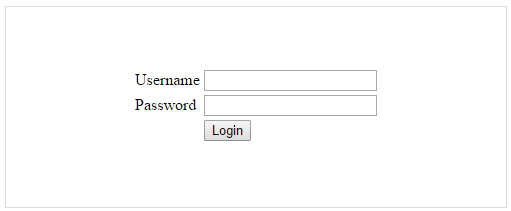
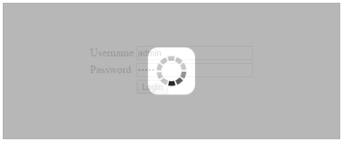

# Getting Started

This section explains briefly about how to create a **WaitingPopup** in your application with **JavaScript**.
**Essential JavaScript WaitingPopup** provides support to display a **WaitingPopup** within your webpage. From the following guidelines, you can learn how to create a **WaitingPopup** in a real-time login page authentication scenario. 

The following screenshot illustrates the functionality of a **WaitingPopup** with login page scenario.

 

You can give the Username and Password in the **login page**. When you click the **Login** button, you get the **WaitingPopup**. After loading, the alert box pops up with the message “Signed in successfully”.

## Create Username and Password

**Essential JavaScript WaitingPopup** widget basically renders built-in features like blocking the other actions until the page is loaded. You can easily create the **WaitingPopup** widget by using simple **&lt;div&gt;** element as follows.

Create an HTML file and add the following template to the HTML file.



<!DOCTYPE html>
<html>
   <head> 
    <link href="//cdn.syncfusion.com/{{ site.releaseversion }}/js/web/flat-azure/ej.web.all.min.css" rel="stylesheet" />
    
    
    
    
     
    
    
    
  </head>
  <body>
   <ej-app>Loading...</ej-app>
  </body>
</html>



Add an element to render a **WaitingPopup.**
 


        <table class="loginTable">
            <tr>
                <td>Username</td>
                <td>
                    <input type="text" /></td>
            </tr>
            <tr>
                <td>Password</td>
                <td>
                    <input type="password" /></td>
            </tr>
            <tr>
                <td></td>
                <td>
                    <button id="button51" (click)="success($event)">login</button></td>
            </tr>
        </table>
        <ej-waitingpopup id="popup" ></ej-waitingpopup>  



Apply the following styles to show the **WaitingPopup**.





The following screenshot displays a **User** **login**.

 

## Add WaitingPopup Widget

Initialize the WaitingPopup in script

To render the ejWaitingPopup using angular directive, we need to inject the ej angular directive with modules shown as below,

 In a real-time login page scenario, when you click the Login button, the WaitingPopup is displayed. 



import {Component} from '@angular/core';
    
    @Component({
        selector: 'sd-home',
        templateUrl: 'app/components/waitingpopup/waitingpopup.component.html' // path for uploadbox component
        })
        export class WaitingPopupComponent { 
            constructor() {        
                }
            success(event){ 
		      var obj = jQuery("#popup").data("ejWaitingPopup");
              obj.setModel({showOnInit: true,target: "#targetElement"});
		    setTimeout(function() {
			 var obj = jQuery("#popup").data("ejWaitingPopup");
			 alert("Signed in successfully");
			 obj.hide();
		     }, 400); 
	      }
                  
       }



 The following screenshot shows the output of the above code example.

 

